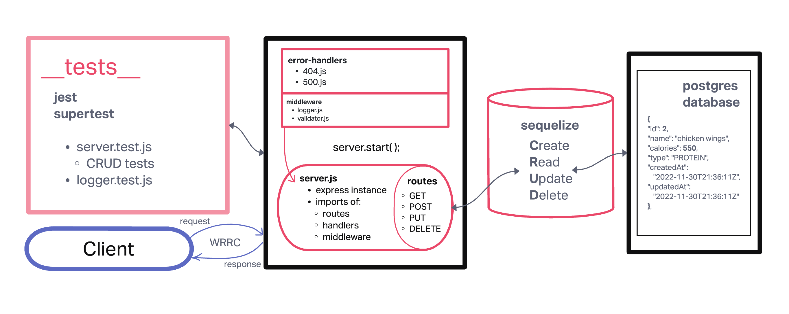

# LAB - Class 03

## Project: Express REST API & TDD

### Author: Dustin Apodaca

### Problem Domain

- Build a REST API using Express, by creating a proper series of endpoints that perform CRUD operations on a database, including server modularization, use of middleware, and tests using the REST standard.

### Links and Resources

- [CI/CD](https://github.com/dustinapodaca/basic-express-server/actions) (GitHub Actions)
- [Prod Deployment](https://basic-express-server-prod.onrender.com)
- [Dev Deployment](https://basic-express-server-4wjg.onrender.com)

### Setup

#### `.env` requirements (where applicable)

see `.env.sample`

- `PORT` - 3004

#### How to initialize/run your application (where applicable)

- nodemon

#### Features / Routes

- Feature One: CRUD operations
- GET : `/` - specific route to hit
- GET : `/food` - READ one record
- GET : `/clothes` - READ one record
- POST : `/food` - CREATE one record
- POST : `/clothes` - CREATE one record
- PUT : `/food` - UPDATE one record
- PUT : `/clothes` - UPDATE one record
- DELETE : `/food` - DESTROY one record
- DELETE : `/clothes` - DESTROY one record
- Feature Two: PostgresSQL, SQLite3
- Feature Three: SQL Data Models
- Feature Four: REST Route Handlers

#### Tests

- How do you run tests?
  - npm test
- Any tests of note?
  - 404 on a bad route
  - 404 on a bad method
  - The correct status codes and returned data for each REST route:
    - Create a record using POST
    - Read a list of records using GET
    - Read a record using GET
    - Update a record using PUT
    - Destroy a record using DELETE

#### UML

Link to an image of the UML for your application and response to events

